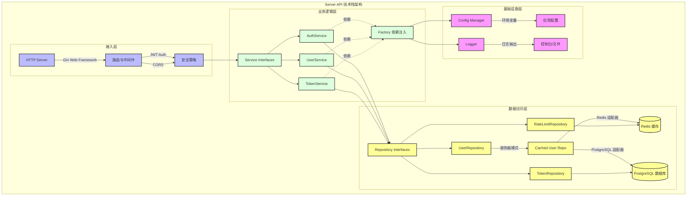

### 图表说明

1.  **接入层 (蓝色)**:
    *   **核心框架**: 使用 **Gin** 作为 HTTP Web 框架，处理路由分发和中间件管理。
    *   **安全机制**: 集成了 **JWT** 身份认证和 **CORS** 跨域支持。

2.  **业务逻辑层 (绿色)**:
    *   **设计模式**: 采用 **接口驱动设计**，定义了 `AuthService`、`UserService` 等核心服务接口。
    *   **依赖管理**: 使用 **Factory (工厂模式)** 进行服务的初始化和依赖注入，解耦各模块。

3.  **数据访问层 (黄色)**:
    *   **仓储模式**: 定义 `Repository` 接口，隔离业务逻辑与数据库操作。
    *   **缓存策略**: 使用 **装饰器模式** 在 `UserRepository` 上叠加缓存功能。
    *   **存储技术**:
        *   **Redis**: 用于高频访问数据的缓存和限流。
        *   **PostgreSQL**: 作为主数据库，负责持久化存储。

4.  **基础设施层 (紫色)**:
    *   **配置管理**: 统一管理环境变量和应用配置。
    *   **日志系统**: 提供统一的日志记录能力。

---

### 补充：技术栈清单

| 层级 | 技术选型 | 用途说明 |
| :--- | :--- | :--- |
| **语言** | Go (Golang) | 高性能、并发友好的后端开发语言 |
| **Web 框架** | Gin | 轻量级、高性能的 HTTP 路由框架 |
| **数据库** | PostgreSQL | 关系型数据库，存储核心业务数据 |
| **缓存** | Redis | 用于会话存储、Token 黑名单及高频查询缓存 |
| **认证** | JWT (JSON Web Tokens) | 无状态的用户身份验证 |
| **架构模式** | Layered Architecture + DDD | 分层架构 + 领域驱动设计思想 (Repository, Service) |